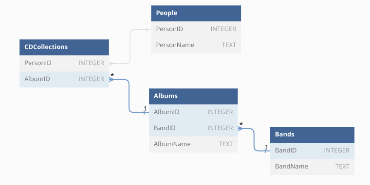

# IT Crowd CD Collections
Code Louisville Data Analytice - Relational Database Demo

## Overview

This is a sample database to explore relational database design. This database
tracks the CD collections of the charecters from the IT Crowd TV series.

## Instructions

The easiest way to work with this database is using the SQLTools extension 
in VSCode.

1. Install the SQLTools extension.
1. Install the SQLTools SQLite driver
1. Connect to the contacts.db database
1. Run the queries in the `sample-queries.sql` file. 
1. Explore the datbase by adding new queries.
1. Execute the query by clicking "run on active connection"
1. If you need to refresh the database you can run the `create_db.py` script. 
This will delete and then re-create the database file.

### Extension Details

| Name | Id | Description | Version | Publisher | Link |
| ---- | -- | ----------- | ------- | --------- | ---- |
| SQLTools | mtxr.sqltools | Connecting users to many of the most commonly used databases. Welcome to database management done right. | 0.27.1 | Matheus Teixeira | [VS Marketplace Link](https://marketplace.visualstudio.com/items?itemName=mtxr.sqltools) |
| SQLTools SQLite | mtxr.sqltools-driver-sqlite | SQLTools SQLite | 0.5.0 | Matheus Teixeira | [VS Marketplace Link](https://marketplace.visualstudio.com/items?itemName=mtxr.sqltools-driver-sqlite) |

## Schema

### Table: Bands
| Column | Type | Constraints |
| ------ | ---- | ----------- |
| BandID | INTEGER | PRIMARY KEY |
| BandName | TEXT | NOT NULL |

### Table Albums
| Column | Type | Constraints |
| ------ | ---- | ----------- |
| AlbumID | INTEGER | PRIMARY KEY |
| BandID | INTEGER | FOREIGN KEY |
| AlbumName | TEXT | NOT NULL |

### Table People
| Column | Type | Constraints |
| ------ | ---- | ----------- |
| PersonID | INTEGER | PRIMARY KEY |
| PersonName | TEXT | NOT NULL |

### Table Table CDCollections
| Column | Type | Constraints |
| ------ | ---- | ----------- |
| AlbumID | INTEGER | FOREIGN KEY |
| PersonID | INTEGER | FOREIGN KEY |
